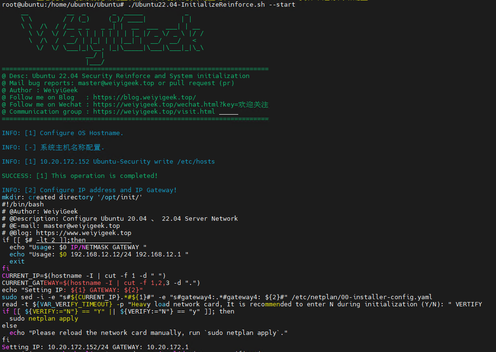
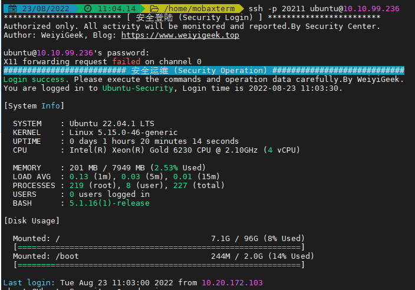

#### :hammer_and_wrench: Ubuntu 系统安全加固工具

描述: 本工具集主要针对于 Ubuntu 22.04 、20.04  LTS 操作系统进行安全加固以及系统初始化操作。

欢迎访问作者个人主页与博客，以及关注微信公众号【WeiyiGeek】，将会分享更多工具。

个人主页: https://www.weiyigeek.top

博客地址：https://blog.weiyigeek.top

学习交流群：https://weiyigeek.top/visit.html


:atom_symbol:**脚本说明:**

```bash
# Ubuntu 22.04 LTS 
# 温馨提示: 请以root用户权限下执行该脚本
./Ubuntu22.04-InitializeReinforce.sh
     __          __  _       _  _____           _
     \ \        / / (_)     (_)/ ____|         | |
     \ \  /\  / /__ _ _   _ _| |  __  ___  ___| | __
       \ \/  \/ / _ \ | | | | | | |_ |/ _ \/ _ \ |/ /
       \  /\  /  __/ | |_| | | |__| |  __/  __/   <
         \/  \/ \___|_|\__, |_|\_____|\___|\___|_|\_\
                      __/ |
                      |___/
======================================================================
@ Desc: Ubuntu 22.04 Security Reinforce and System initialization
@ Mail bug reports: master@weiyigeek.top or pull request (pr)
@ Author : WeiyiGeek
@ Follow me on Blog   : https://blog.weiyigeek.top/
@ Follow me on Wechat : https://weiyigeek.top/wechat.html?key=欢迎关注
@ Communication group : https://weiyigeek.top/visit.html
======================================================================

Usage: ./Ubuntu22.04-InitializeReinforce.sh [--start ] [--network] [--function] [--clear] [--version] [--help]
Option:
  --start            Start System initialization and security reinforcement.
  --network          Configure the system network and DNS resolution server.
  --function         PCall the specified shell function.
  --clear            Clear all system logs, cache and backup files.
  --version          Print version and exit.
  --help             Print help and exit.

Mail bug reports or suggestions to <master@weiyigeek.top> or pull request (pr).
current version : 1.0
```

<br/>

:atom_symbol:**脚本目录:**
描述: 为了方便后期维护以及大家pr，此处进行分类并做成了函数调用方式进行，每个函数都是可独立运行的。
```bash
:~$ tree Ubuntu/
Ubuntu/
├── Ubuntu22.04-InitializeReinforce.sh
├── config
│   └── Ubuntu22.04.conf
├── example
│   └── 22.04
└── scripts
    ├── os-base.sh
    ├── os-clean.sh
    ├── os-exceptions.sh
    ├── os-info.sh
    ├── os-manual.sh
    ├── os-network.sh
    ├── os-optimize.sh
    ├── os-security.sh
    ├── os-service.sh
    └── os-software.sh

4 directories, 12 files
```


:atom_symbol:**脚本函数:**

描述: 如下脚本将根据参数在 `Ubuntu22.04-InitializeReinforce.sh` 分别进行调用执行, 也可采用`--function `参数进行指定调用。

```bash
❯ grep -r -n  "函数名称" -A 1 *
scripts/os-base.sh:26:# 函数名称: base_hostname
scripts/os-base.sh-27-# 函数用途: 主机名称设置
--
scripts/os-base.sh:55:# 函数名称: ubuntu_mirror
scripts/os-base.sh-56-# 函数用途: ubuntu 系统主机软件仓库镜像源
--
scripts/os-base.sh:126:# 函数名称: ubuntu_software
scripts/os-base.sh-127-# 函数用途: ubuntu 系统主机内核版本升级以常规软件安装
--
scripts/os-base.sh:153:# 函数名称: base_timezone
scripts/os-base.sh-154-# 函数用途: 主机时间同步校准与时区设置
--
scripts/os-base.sh:192:# 函数名称: base_banner
scripts/os-base.sh-193-# 函数用途: 远程本地登陆主机信息展示
--
scripts/os-base.sh:345:# 函数名称: base_reboot
scripts/os-base.sh-346-# 函数用途: 是否进行重启或者关闭服务器
--
scripts/os-clean.sh:27:# 函数名称: system_clean
scripts/os-clean.sh-28-# 函数用途: 删除安全加固过程临时文件清理为基线镜像做准备
--
scripts/os-exceptions.sh:26:# 函数名称: problem_usercrond
scripts/os-exceptions.sh-27-# 函数用途: 解决普通用户定时任务无法定时执行问题
--
scripts/os-exceptions.sh:45:# 函数名称: problem_multipath
scripts/os-exceptions.sh-46-# 函数用途: 解决 ubuntu multipath add missing path 错误
--
scripts/os-network.sh:27:# 函数名称: net_config
scripts/os-network.sh-28-# 函数用途: 主机IP地址与网关设置
--
scripts/os-network.sh:70:# 函数名称: net_dns
scripts/os-network.sh-71-# 函数用途: 设置主机DNS解析服务器
--
scripts/os-optimize.sh:27:# 函数名称: optimize_kernel
scripts/os-optimize.sh-28-# 函数用途: 系统内核参数的优化配置
--
scripts/os-optimize.sh:84:# 函数名称: resources_limits
scripts/os-optimize.sh-85-# 函数用途: 系统资源文件打开句柄数优化配置
--
scripts/os-optimize.sh:115:# 函数名称: swap_partition
scripts/os-optimize.sh-116-# 函数用途: 创建系统swap分区
--
scripts/os-security.sh:27:# 函数名称: sec_usercheck
scripts/os-security.sh-28-# 函数用途: 用于锁定或者删除多余的系统账户
--
scripts/os-security.sh:65:# 函数名称: sec_userconfig
scripts/os-security.sh-66-# 函数用途: 针对拥有ssh远程登陆权限的用户进行密码口令设置。
--
scripts/os-security.sh:131:# 函数名称: sec_passpolicy
scripts/os-security.sh-132-# 函数用途: 用户密码复杂性策略设置 (密码过期周期0~90、到期前15天提示、密码长度至少12、复杂度设置至少有一个大小写、数字、特殊字符、密码三次不能一样、尝试次数为三次）
--
scripts/os-security.sh:166:# 函数名称: sec_sshdpolicy
scripts/os-security.sh-167-# 函数用途: 系统sshd服务安全策略设置
--
scripts/os-security.sh:194:# 函数名称: sec_loginpolicy
scripts/os-security.sh-195-# 函数用途: 用户登陆安全策略设置
--
scripts/os-security.sh:230:# 函数名称: sec_historypolicy
scripts/os-security.sh-231-# 函数用途: 用户终端执行的历史命令记录安全策略设置
--
scripts/os-security.sh:261:# 函数名称: sec_grubpolicy
scripts/os-security.sh-262-# 函数用途: 系统 GRUB 安全设置防止物理接触从grub菜单中修改密码
--
scripts/os-security.sh:304:# 函数名称: sec_firewallpolicy
scripts/os-security.sh-305-# 函数用途: 系统防火墙策略设置, 建议操作完成后重启计算机.
--
scripts/os-security.sh:335:# 函数名称: sec_ctrlaltdel
scripts/os-security.sh-336-# 函数用途: 禁用 ctrl+alt+del 组合键对系统重启 (必须要配置我曾入过坑)
--
scripts/os-security.sh:355:# 函数名称: sec_recyclebin
scripts/os-security.sh-356-# 函数用途: 设置文件删除回收站别名(防止误删文件)(必须要配置,我曾入过坑)
--
scripts/os-security.sh:405:# 函数名称: sec_supolicy
scripts/os-security.sh-406-# 函数用途: 切换用户日志记录和切换命令更改名称为SU(可选)
--
scripts/os-security.sh:425:# 函数名称: sec_privilegepolicy
scripts/os-security.sh-426-# 函数用途: 系统用户sudo权限与文件目录创建权限策略设置
--
scripts/os-service.sh:26:# 函数名称: svc_apport
scripts/os-service.sh-27-# 函数用途: 禁用烦人的apport错误报告
--
scripts/os-service.sh:52:# 函数名称: svc_snapd
scripts/os-service.sh-53-# 函数用途: 不使用snapd容器的环境下禁用或者卸载多余的snap软件及其服务
--
scripts/os-service.sh:75:# 函数名称: svc_cloud-init
scripts/os-service.sh-76-# 函数用途: 非云的环境下禁用或者卸载多余的cloud-init软件及其服务
--
scripts/os-service.sh:101:# 函数名称: svc_debugshell
scripts/os-service.sh-102-# 函数用途: 在系统启动时禁用debug-shell服务
--
scripts/os-software.sh:26:# 函数名称: install_chrony
scripts/os-software.sh-27-# 函数用途: 安装配置 chrony 时间同步服务器
--
scripts/os-software.sh:79:# 函数名称: install_java
scripts/os-software.sh-80-# 函数用途: 安装配置java环境
--
scripts/os-software.sh:110:## 函数名称: install_docker
scripts/os-software.sh-111-## 函数用途: 在 Ubuntu 主机上安装最新版本的Docker
--
scripts/os-software.sh:201:## 函数名称: install_cockercompose
scripts/os-software.sh-202-## 函数用途: 在 Ubuntu 主机上安装最新版本的Dockercompose
```


:atom_symbol:**脚本使用:**

描述: 通常针对于才安装的服务器系统，针对ubuntu初始化可以在 `Ubuntu22.04.conf` 中进行相应配置，然后在执行该脚本。

```bash
# 执行权限赋予
chmod +x -R *

# 开始初始化加固
Ubuntu22.04-InitializeReinforce.sh  --start
```




加固结果查看： 
```bash
ssh -p 20221 ubuntu@10.10.99.236
su - root
```



温馨提示：脚本中默认root密码为`R2022.weiyigeek.top`。

温馨提示: 防火墙策略只开放了80，443，22，20221等端口。